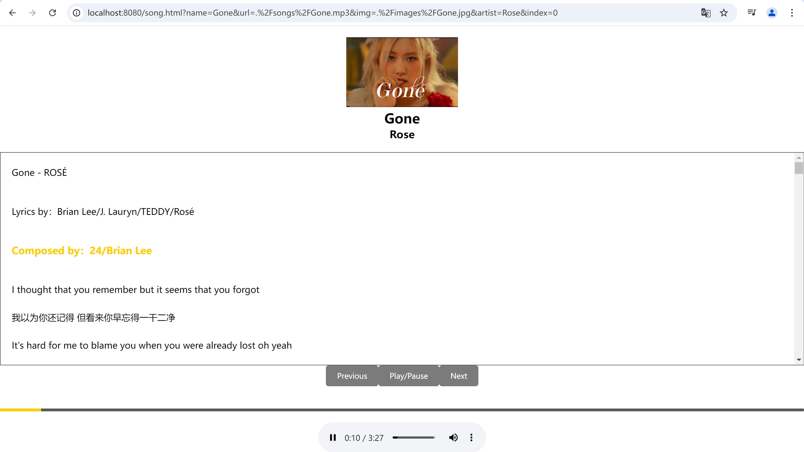
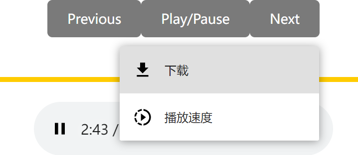
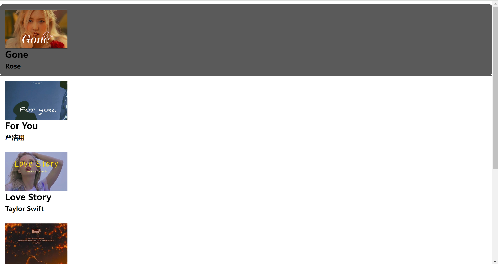
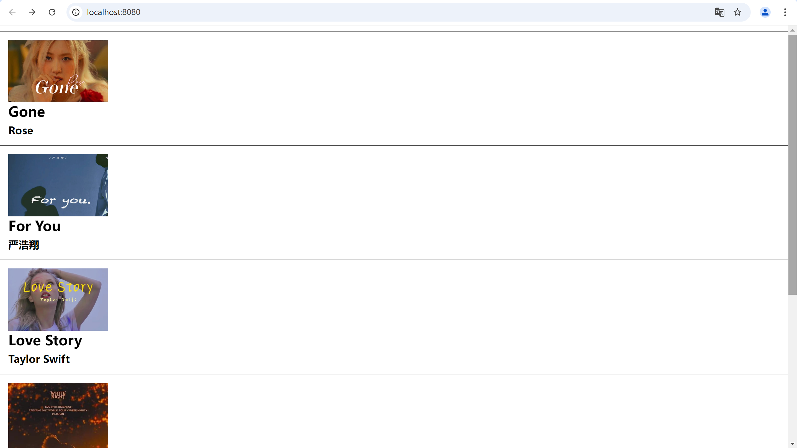

# 1. 项目简介
## 项目名称
MusicPlayer

## 项目描述
该项目是一个音乐播放器，提供音乐播放、歌词同步等功能，用户可以通过简介的页面浏览歌曲、查看歌词，并在独立页面播放歌曲。

## 主要功能
- 同步显示歌词（支持LRC格式）
- 播放歌曲、暂停、上一曲、下一曲功能
- 显示歌曲封面、歌曲名和歌手信息
- 下载歌曲、倍速播放

# 2. 技术栈
前端：HTML、CSS、JavaScript

其他工具：使用LRC格式进行歌词同步。

# 3. 功能详情
## 音乐播放器
- 用户可以通过暂停、暂停、切换歌曲等按钮进行操作。
- 播放时动态显示歌词，歌词与歌曲同步滚动。
- 支持查看当前播放的歌曲封面、歌手信息。


- 下载歌曲、倍速播放。

## 歌单管理
- 在歌单页面中，点击歌曲会跳转到该歌曲的播放页面。


## 歌词同步
使用 LRC 文件与歌曲时间戳同步显示歌词，当前播放的歌词行会高亮显示。

## 导航
- 用户可以在歌单页面浏览歌曲，点击进入歌曲详情页进行播放和查看歌词。


# 4. 安装指南
## 前置条件：需要先安装Node.js和npm。

## 克隆项目：
```bash
git clone https://github.com/liyaqi2024/One

## 安装依赖：npm isntall

## 启动服务器:node server.js

## 访问网站:在浏览器中访问http://localhost:8080

# 5. 文件结构
├── .vscode                                          
│   └─launch.json                                 //配置文件
├── fonts                                         //项目使用的字体
├── images                                        //歌曲封面                
├── lyrics                                        //歌词文件
├── node_modules                                  //npm安装的依赖包  
├── songs                                         //歌曲音频
├── index.html                                    //网站主页
├── package-lock.json                             //记录依赖版本的文件
├── package.json                                  //项目描述文件，包含依赖和脚本
├── script.js                                     //主 JavaScript 文件，处理网站逻辑
├── server.js                                     //Node.js 服务器端代码
├── song.html                                     //单曲播放页面
├── style.css                                     //网站样式文件

# 6. 使用说明
## 播放音乐：用户可以在歌单页面浏览歌曲，点击歌曲进入播放页面，同时查看歌词。

## 操作界面导航：用户点击歌曲就会从歌单页面切换到歌曲播放页面，通过点击按钮实现播放、暂停、切换、下载、倍速播放歌曲的功能。

# 7. 开发笔记
## 歌词同步实现：

    1.LRC文件格式：LRC 文件的每一行通常包含一个时间戳和对应的歌词文本，格式为 [mm:ss.xx]歌词内容。
    
    2.解析LRC文件： 在代码中，我使用 fetch 函数异步获取 LRC 文件内容，然后通过 parseLyrics 函数对其进行解析。该函数将每一行的时间戳和歌词文本提取并存储到一个数组中，以便后续使用：
    function parseLyrics(data) {
    const lines = data.split('\n');
    for (let line of lines) {
        const match = line.match(/\[(\d+):(\d+\.\d+)\](.*)/);
        if (match) {
            const minutes = parseInt(match[1]);
            const seconds = parseFloat(match[2]);
            const lyricText = match[3].trim();
            const time = minutes * 60 + seconds;
            lyrics.push({ time, text: lyricText });
        }
    }
}

    3.歌词显示与更新： 一旦获取并解析了歌词，可以使用 displayLyrics 函数将歌词显示在页面上。在歌曲播放过程中，updateLyrics 函数会根据当前音频的播放时间来判断并更新高亮显示的歌词：
    function updateLyrics() {
    const currentTime = audio.currentTime;

    for (let i = 0; i < lyrics.length; i++) {
        if (currentTime < lyrics[i].time) {
            const previousLyric = lyricsContainer.children[i - 1];
            if (previousLyric) {
                previousLyric.classList.add('active');
                previousLyric.scrollIntoView({ behavior: 'smooth', block: 'center' });
            }
            break;
        }
    }
}
    在这里，我通过 audio.currentTime 属性获取当前播放时间，并在歌词数组中查找与当前时间匹配的歌词，进而更新显示效果。
    
    4.进度条同步： 除了歌词同步，我还实现了音频播放进度条的同步。使用 updateProgress 函数计算当前播放时间在音频总时长中的比例，并相应更新进度条的宽度：
        function updateProgress() {
    const progressBar = document.getElementById('progress-bar');
    const progress = (audio.currentTime / audio.duration) * 100;
    progressBar.style.width = progress + '%';
}

# 8. 未来优化
目前，我的页面只实现了基本的歌单和歌词功能，设计比较简洁。未来，我希望能够开发出一个类似于网易云音乐的播放页面，以增强用户体验。将着重于以下几个方面的优化：
  ## 美观的界面设计：采用更现代化的UI设计，使页面更具吸引力。
  
  ## 播放功能扩展：实现单曲循环、随机播放和列表循环等播放选项，让用户可以根据自己的喜好选择播放方式。
  ## 响应式设计：确保在各种设备上的良好显示效果，以提高用户体验。
 


 
